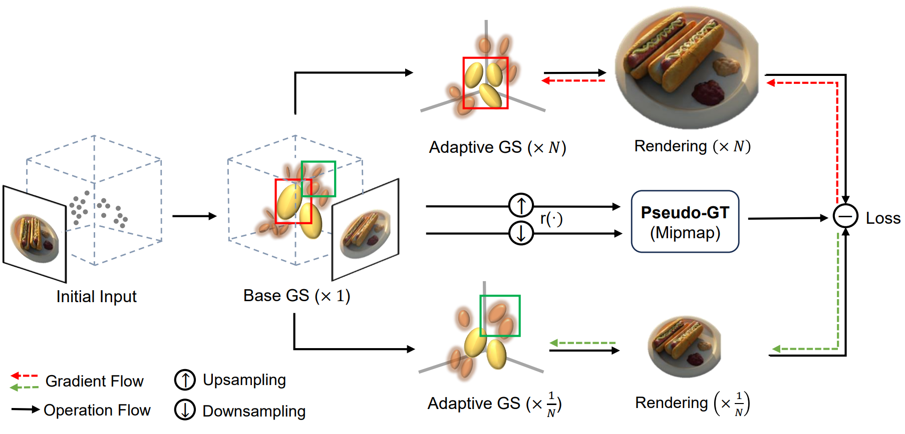

# Mipmap-GS [3DV'25 ]
<a href="https://arxiv.org/abs/2408.06286">arXiv</a> | <a href="https://github.com/renaissanceee/Mipmap-GS">Project Page</a>

Let Gaussians Deform with Scale-specific Mipmap for Anti-aliasing Rendering.
<p>
    <br>
    
    <br>
</p>


## Installation
Clone the repository and create an anaconda environment using
```
git clone https://github.com/renaissanceee/Mipmap-GS.git
cd Mipmap-GS

conda create -y -n mipmap-gs python=3.8
conda activate mipmap-gs

pip install torch==1.12.1+cu113 torchvision==0.13.1+cu113 -f https://download.pytorch.org/whl/torch_stable.html
conda install cudatoolkit-dev=11.3 -c conda-forge

pip install -r requirements.txt

pip install submodules/diff-gaussian-rasterization
pip install submodules/simple-knn
```
## Dataset and Checkpoints
#### Blender Dataset
Please download and unzip nerf_synthetic.zip from the [NeRF's official Google Drive](https://drive.google.com/drive/folders/128yBriW1IG_3NJ5Rp7APSTZsJqdJdfc1).

#### Mip-NeRF 360 Dataset
Please download the data from the [Mip-NeRF 360](https://jonbarron.info/mipnerf360/) and request the authors for the treehill and flowers scenes.

#### SwinIR Checkpoints
Download [SwinIR](https://github.com/JingyunLiang/SwinIR/releases) checkpoints into [here](https://github.com/renaissanceee/Mipmap-GS/tree/main/pseudo_GT/SwinIR/model_zoo/swinir).
## Pretrained 3DGS
```
# single-scale training and multi-scale testing (stmt) on nerf-synthetic
python scripts/run_syn_stmt_up.py	 --->zoom-in
python scripts/run_syn_stmt_down.py 	--->zoom-out

# mip-nerf 360
python scripts/run_360_stmt_up.py	  
python scripts/run_360_stmt_down.py	 

# zoom-in mipmap
python pseudo_GT/SwinIR/run_swinir_syn.py --source "./nerf_synthetic/" --gt_root "./benchmark_nerf_synthetic_stmt_up"
python pseudo_GT/SwinIR/run_swinir_360.py

# zoom-out mipmap
python pseudo_GT/bilinear/downsample_syn.py --source "./nerf_synthetic/" --gt_root "./benchmark_nerf_synthetic_stmt_down"
python pseudo_GT/bilinear/downsample_360.py
```

## Mipmap-GS
```
# run Mipmap-GS on nerf-synthetic 
python scripts/ours/run_syn_stmt_up_swin.py	 --->zoom-in
python scripts/ours/run_syn_stmt_down.py 	--->zoom-out

# mip-nerf 360 
python scripts/ours/run_360_stmt_up_swin.py	
python scripts/ours/run_360_stmt_down.py	 

# metrics
python scripts/ours/metrics_syn_stmt_up_swin.py
python scripts/ours/metrics_syn_stmt_down.py
python scripts/ours/metrics_360_stmt_up_swin.py
python scripts/ours/metrics_360_stmt_down.py
```

# Acknowledgements
This project is built upon [3DGS](https://github.com/graphdeco-inria/gaussian-splatting) and [Mip-Splatting](https://github.com/autonomousvision/mip-splatting.git). The SR model is from [SwinIR](https://github.com/JingyunLiang/SwinIR.git).
We thank all the authors for their great work and repos. 
